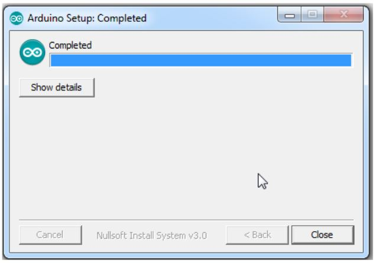
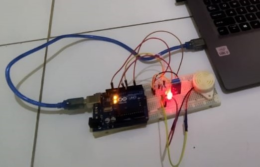

<div style="text-align: center;">
<h1 style="margin: 2px;">Ujian Akhir Semester</h1>
<h2 style="margin: 2px">Alat Pendeteksi Gempa</h2>
<p>Mata Kuliah: Organisasi dan Arsitektur Komputer</p>


<p>

<br>Disusun Oleh:
<br>Ahmad Maulidi Roofiad `1197050009`
<br>Muhammad Rihap Firdaus `1217050102`
<br>Nasywah Darraini `1217050109`
<br>Reski Firmansyah `1217050119`
<br>Wildan Fathu Rijan `1217050141`
<br>Yandiyan `1217050144`

</p>

### [Teknik Informatika](http://if.uinsgd.ac.id/) | [UIN Sunan Gunung Djati Bandung](https://uinsgd.ac.id/) 
</div>

<hr>

## Daftar Isi
>1. [`Abstrak`](#abstrak)
>1. [`Pendahuluan`](#latar-belakang)
>       - [`Latar Belakang`](#latar-belakang)
>       - [`Tujuan Percobaan`](#tujuan-percobaan)
>1. [`Dasar Teori`](#dasar-teori)
>1. [`Alat dan Komponen`](#alat-dan-komponen)
>1. [`Tahapan Perakitan Alat`](#tahapan-perakitan-alat)
>       - [`Flowchart`](#flowchart)
>       - [`Skema`](#skema-arduino)
>       - [`Panduan Merakit Komponen`](#perakitan-alat)
>       - [`Memprogram Arduino`](#memprogram-arduino)
>1. [`Hasil Pengujian dan Analisis`](#hasil-pengujian-dan-analisis)
>1. [`Kesimpulan`](#kesimpulan)
>1. [`Daftar Pustaka`](#daftar-pustaka)


<div style="text-align: justify">
<hr>

## Abstrak

<p style="text-align: justify;">Wilayah Indonesia merupakan wilayah rawan gempa dengan macam-macam gempa seperti gempa tektonik dan gempa vulkanik. Gempa bumi tidak dapat diprediksi. Hal ini menyebabkan terjadinya gempa secara tiba-tiba di daerah yang terkena dari dampak getaran tersebut. Banyak korban jiwa yang tidak dapat menyelamatkan diri karena terjebak di tempat tersebut atau karena kurangnya informasi tentang gempa yang terjadi di sana. Dimana teknologi pendeteksi gempa masih menggunakan tenaga manusia atau tenaga konvensional sebagai operatornya. Hal yang penting dalam bencana gempa adalah kecepatan masyarakat menerima informasi dari sistem pendeteksi gempa, karena gempa terjadi sangat cepat. </p>

<p style="text-align: justify;">Pada Tugas Akhir kali ini akan dilakukan perancangan dan implementasi alat pendeteksi gempa bumi berbasis sensor getar. Rancangan sistem ini tersusun atas sensor getar dan mikrokontroler Arduino Uno. Sensor getar digunakan untuk mengetahui berapa besar getaran yang terjadi pada area di sekitar yang memiliki keluaran ADC dan di ubah ke dalam tegangan. Sistem ini akan menentukan jenis kekuatan gempa sesuai kekuatan yang dibaca oleh sensor sw-420. </p>

***Kata Kunci** : sensor getar sw-420, Gempa.*

<hr>

## Latar Belakang

<p style="text-align:justify">Gempa bumi adalah peristiwa bergetarnya bumi akibat pelepasan energi di dalam bumi secara tiba-tiba yang ditandai dengan patahnya lapisan batuan pada kerak bumi. Akumulasi energi penyebab terjadinya gempa bumi dihasilkan dari pergerakan lempeng-lempeng tektonik. Energi yang dihasilkan dipancarkan ke segala arah berupa gelombang gempa bumi sehingga efeknya dapat dirasakan sampai ke permukaan bumi. Katalog United States Geological Survey (USGS) mencatat empat kejadian gempa bumi besar di Indonesia yaitu gempa bumi Banda (8,5 Mw) tahun 1983, gempa bumi Sumatera–Andaman Islands (9,1 Mw) tahun 2004, gempa bumi Sumatera Utara/Nias (8,6 Mw) tahun 2005 (USGS, 2009) dan gempa bumi Pantai Barat Sumatera (8,6 Mw) tahun 2012 (USGS, 2012). Data ini menunjukkan bahwa Indonesia merupakan negara yang memiliki tingkat intensitas kegempaan yang tinggi. Ini menjadikan Indonesia tidak terhindarkan dari dampak negatif yang akan ditimbulkan oleh gempa bumi. Selain mengakibatkan jatuhnya korban jiwa, gempa bumi juga menyebabkan kerusakan infrastruktur fisik dimana kerusakan unit bangunan menjadi yang paling dominan. Angka kerusakan bangunan akibat gempa bumi besar yang pernah tercatat diketahui terjadi di kota Banda Aceh tahun 2004 dengan angka kerusakan total bangunan mencapai 35 persen dari keseluruhan bangunan yang ada (Irwansyah, 2010). Indonesia termasuk negara yang rawan akan terjadinya gempa bumi hal ini dikarenakan indonesia terletak di atas tiga lempeng yakni lempeng eurasia, lempeng pasifik, dan lempeng indo-australia. </p>
<p style="text-align:justify">Berdasarkan teori di atas maka kelompok kami bermaksud membuat sebuah alat yang dirancang untuk mendeteksi gempa melalui sensor getaran. pendeteksi gempa bumi pada penelitian ini menggunakan sensor  SW-420, agar hasil dari pengujian sistem ini mampu mengetahui lebih awal akan terjadinya getaran gempa bumi. Dalam hal ini kami telah menganalisa dan merancang komponen-komponen pendukung untuk membuat alat sederhana “Pendeteksi Gempa bumi” seperti arduino, module alarm dan lain sebagainya. </p>


<hr>

## Tujuan Percobaan
1.	Untuk memenuhi tugas akhir pengganti Ujian Akhir Semester. 
2.	Mahasiswa mampu mengimplementasikan materi-materi yang telah diajarkan oleh dosen pengampu. 
3.	Mahasiswa mampu mengetahui rangkaian-rangkaian sederhana dan dapat menyusunnya menjadi alat yang berguna.
4.	Mahasiswa mampu mengetahui rangkaian-rangkaian sederhana dan mengetahui akan fungsinya. 
5.	Mahasiswa dapat mengenal arduino. 

<hr>

## Dasar Teori
### Tipe Gempa Bumi

Ada dua jenis gempa di dunia yaitu gempa tektonik dan gempa vulkanik. Gempa vulkanik adalah jenis gempa bumi yang disebabkan oleh aktivitas magma di interior bumi. Sebelum gunung berapi meletus, biasanya terjadi osilasi seismik di sekitar gunung berapi. Getaran ini disebut gempa vulkanik. Sedangkan gempa tektonik adalah perubahan lapisan lempeng baik di permukaan maupun di dasar bumi. Berdasarkan letak pergerakan lempeng tektonik, ada yang menyebabkan gempa bumi di darat dan ada pula yang menyebabkan tsunami di laut. Adapun parameter dari gempa bumi yaitu : 
1. Episenter atau episentrum gempa adalah titik di permukaan bumi dimana gempa dirasakan dan terekam. Pusat gempa berada tepat di atas hiposentrum tetapi di permukaan bumi. Gempa bumi episentrum adalah hasil dari gempa bumi hiposentrum. Episentrum yang merupakan pusat gempa bumi biasanya mengalami goncangan terkuat karena merasakan getaran gelombang terkuat dari hiposentrum. Sisa gelombang seismik mengalir ke permukaan sekitarnya. 
1. 	Hiposentrum (hypocentre) adalah pusat gempa bumi yaitu tempat terjadinya perubahan lapisan batuan atau dislokasi di dalam bumi sehingga menimbulkan gempa bumi. Jenis-jenis gempa bumi berdasarkan kedalaman hiposentrumnya, yaitu : 
    -	Gempa bumi jenis dangkal (normal), dengan pusat < 70 km. 
    -	Gempa bumi sedang (intermediet), dengan pusat gempa 70 - 300 km. 
    -	Gempa bumi dalam, dengan pusat gempa > 300 km. 


###	Jenis Getaran Gempa 

Dilihat dari jenis getarnya terjadinya suatu gempa dapat diamati oleh gejala yang ada di hiposentrum yang merambat ke permukaan bumi dengan dua macam gelombang, yaitu : 
1. Gelombang Primer (Longitudinal) merupakan gelombang yang merambat dari hiposentrum ke segala arah yang tercatat oleh seismograf dengan kecepatan antara 7-14 km/detik dengan periode gelombang 5-7 detik. 
1. Gelombang Sekunder (Transversal) merupakan gelombang yang merambat dari hiposentrum ke segala arah yang tercatat sebagai gelombang kedua oleh seismograf dengan kecepatan antara 4-7 km/detik dengan periode gelombang 11-13 detik. 


### Sensor 
Merupakan transduser yang berfungsi untuk mengolah variasi dari suatu nilai berupa cahaya, gerak atau panas menjadi tegangan serta arus listrik. Transduser sendiri memiliki arti yaitu mengubah. Bentuk perubahan yang dimaksud adalah kemampuan mengubah suatu energi ke dalam bentuk energi yang lain. Energi yang diolah bertujuan untuk menunjang dari pada kinerja piranti yang menggunakan sensor itu sendiri. Sensor sendiri digunakan dalam proses pendeteksi untuk proses pengukuran. Dalam tugas akhir ini sensor yang digunakan ialah sensor getar sw-420.


### Sensor Getar 
Sensor getar adalah suatu alat yang mempunyai fungsi untuk mendeteksi getaran dan akan diubah kedalam sinyal listrik. Sensor getar sw-420 memiliki sensitivitas yang sangat tinggi terhadap getaran yang ada. Sensor getar sw-420 mempunyai 2 jenis output yaitu, output analog dan juga output digital. Sensitivitas pada output digital dapat diatur dengan potensiometer yang ada pada sensor. Sensor ini dapat membaca suatu nilai output analog berupa ADC untuk mendapatkan nilai dari suatu kondisi getaran yang terjadi di sekitar.


### Arduino 
Arduino dikatakan sebagai sebuah platform dari physical computing yang bersifat open source. Pertama-tama perlu dipahami bahwa kata “platform” di sini adalah sebuah pilihan kata yang tepat. Arduino tidak hanya sekedar sebuah alat pengembangan, tetapi ia adalah kombinasi dari hardware, bahasa pemrograman dan Integrated Development Environment (IDE) yang canggih. IDE adalah sebuah software yang sangat berperan untuk menulis program, meng-compile menjadi kode biner dan meng-upload ke dalam memory microcontroller.

<hr>

## Alat dan Komponen

| Nama Alat dan Komponen | Jumlah |
|------------------------|:---:|
|Arduino Uno|1|
|Kabel Usb type B|1|
|breadboard|1|
|Sensor getar sw-420|1|
|LED merah dan LED hijau masing-masing satu buah|1|
|Resistor 220 ohm 2 buah|1|
|kabel jumper|secukupnya|
|buzzer 3-24v|opsional|
|Komputer/laptop yang didalamnya telah di instal arduino IDE|1|

<hr>

## Tahapan Perakitan Alat
### Instalasi IDE Arduino
Sebelum dapat berfungsi seperti yang kita inginkan, kita perlu memprogram Arduino terlebih dahulu menggunakan Software IDE Arduino. Berikut petunjuk untuk instalasi IDE Arduino. 
1.	Download file software Arduino IDE untuk windows
Untuk mendownload Arduino IDE anda dapat mengunjungi link: https://www.arduino.cc/en/Main/Software. Kemudian pilih Windows Installer paling atas. Setelah itu akan tampil pilihan Download. Silahkan klik Just Download atau Contribute dan Download untuk donasi. 

<div style="width : 70%; display: block; margin-left: auto; margin-right: auto; text-align: center; font-style: italic;">

gambar 1.1 : download software

gambar 1.2 : opsi download
</div>

2. 	Persetujuan instalasi software IDE Arduino
Setelah selesai download silahkan buka dengan klik kiri dua kali atau klik kanan open kemudian akan muncul License Agreement atau Persetujuan Instalasi, klik tombol I Agree untuk memulai install software Arduino IDE.

<div style="width : 70%; display: block; margin-left: auto; margin-right: auto; text-align: center; font-style: italic;">

gambar 1.3 : license agreement
</div>

3. Pilihan opsi instalasi
Untuk Installation Option pilih semua option dan klik tombol Next. 
<div style="width : 70%; display: block; margin-left: auto; margin-right: auto; text-align: center; font-style: italic;">

gambar 1.4 : opsi instalasi
</div>

4. Pilih folder untuk menempatkan file Arduino IDE
Installation Folder atau Pilihan Folder untuk memilih folder tempat menyimpan program arduino dan klik tombol install untuk memulai proses instalasi software.
<div style="width : 70%; display: block; margin-left: auto; margin-right: auto; text-align: center; font-style: italic;">

gambar 1.5 : pilih installation folder
</div>

5. Proses extract dan Instalasi di mulai
Proses instalasi di mulai,program di extract ke Windows.
<div style="width : 70%; display: block; margin-left: auto; margin-right: auto; text-align: center; font-style: italic;">

gambar 1.6 : proses instalasi
</div>

6. Install USB Driver
Saat proses instalasi sedang berlangsung akan muncul pilihan untuk install driver, pilih tombol instal,proses ini untuk mengenali dan melakukan komunikasi dengan board arduino melalui port USB. 
<div style="width : 80%; display: block; margin-left: auto; margin-right: auto; text-align: center; font-style: italic;">

gambar 1.7 : instalasi usb driver
</div>

7. Proses instalasi selesai
Setelah selesai silahkan klik close. 
<div style="width : 70%; display: block; margin-left: auto; margin-right: auto; text-align: center; font-style: italic;">

gambar 1.8 : proses instalasi selesai
</div>

8. Start Software IDE Arduino
Proses instalasi Software Arduino sudah selesai terinstal di windows. Cek di Desktop Windows atau Start Menu untuk menjalankan Software IDE Arduino. Double Klik icon Arduino di desktop atau klik di Start Menu. 
<div style="width : 70%; display: block; margin-left: auto; margin-right: auto; text-align: center; font-style: italic;">

gambar 1.9 : memulai software IDE
</div>

9. Jendela awal Software IDE Arduino
<div style="width : 70%; display: block; margin-left: auto; margin-right: auto; text-align: center; font-style: italic;">

gambar 1.10 : jendela awal software
</div>

### Flowchart
<div style="width : 40%; display: block; margin-left: auto; margin-right: auto; text-align: center; font-style: italic;">

gambar 2.1 : flowchart
</div>

### Skema Arduino
<div style="width : 40%; display: block; margin-left: auto; margin-right: auto; text-align: center; font-style: italic;">

gambar 2.2 : skema arduino
</div>

### Perakitan Alat

1. Letakkan sensor dan led seperti pada gambar skema
1. Hubungkan resistor di setiap kaki positif led
1. Sambungkan setiap kaki negatif led dan pin ground sensor ke pin grund arduino
1. Setelah itu sambungkan pin vcc sensor dengan pin nopol arduino, seangkan pin out sensor ke pin 3 arduino
1. Kemudian sambungkan kaki positif led merah yang terhubung dengan reistor ke pin 8 arduino, dan kaki positif led hijau ke pin 7 arduino
1. Terakhir sambungkan kaki positif buzzer pada kaki positif led hijau, dan kaki negatif buzzer pada kaki negatif led hijau (opsional). 
<br>Hasil akhir alat akan terlihat seperti gambar dibawah ini:
<div style="width : 70%; display: block; margin-left: auto; margin-right: auto; text-align: center; font-style: italic;">

gambar 3.1 : hasil rangkaian
</div>

### Memprogram Arduino
Program yang dipakai pada arduino:
```c
const int pinGetar = 3; 	
const int ledRed = 8;   	
const int ledGreen = 7; 	
 
void setup() {
Serial.begin (9600);    	
pinMode (ledRed, OUTPUT);   
pinMode (ledGreen, OUTPUT); 
}
 
void loop() {
int datadigital = digitalRead (pinGetar);
Serial.print ("Sensor : ");
Serial.print (datadigital);
 
if (datadigital == 1) {
  Serial.println (" mendeteksi getaran");
  digitalWrite (ledGreen, HIGH);
  digitalWrite (ledRed, LOW);
} else if (datadigital == 0) {
  Serial.println (" Tidak mendeteksi getaran");
  digitalWrite (ledGreen, LOW);
  digitalWrite (ledRed, HIGH);
}
}
```
<br>

`Penjelasan dari Source Code:`
<br>
<br>`Inisialisasi variabel`, nama dari variabel boleh bebas, asalkan tidak terlalu panjang, tidak terdapat spasi dan mudah dimengerti. 

```c
const int pinGetar = 3;
```
Menginisialisasikan int 3 ke variabel pin getar, karena kita akan menghubungkan pin 3 pada arduino ke pin output pada sensor. 

```c
const int ledRed = 8;
```
Menginisialisasikan int 8 ke variabel ledRed, karena kita akan menghubungkan pin 8 pada arduino ke kaki positif led merah. 

```c
const int ledGreen = 7;
```

Untuk menginisialisasikan int 7 ke variabel ledGreen, karena kita akan menghubungkan pin 8 pada arduino ke kaki positif led hijau.  


`Membuat fungsi setup()`, setiap program Arduino memiliki fungsi setup(), tujuan dari fungsi ini adalah menyediakan lingkungan (settingan) seperti pin input, output sebelum dijalankan program utama di Arduino. 

```c
void setup() {
Serial.begin (9600);    	
```
Menyalakan program serial monitor, karena serial monitor akan digunakan sebagai pemonitoring data pada sensor. 

```c
pinMode (ledRed, OUTPUT);   
pinMode (ledGreen, OUTPUT); 
}
```
Menetapkan pin 8 yang dihubungkan ke led merah dan pin 7 yang dihubungkan ke led hijau sebagai output dari program. 

`Membuat fungsi loop()`, apapun yang ditaruh di dalam fungsi loop(), program di dalamnya akan terus menerus mengalami running (perulangan). Hal tersebut akan berakhir jika daya dicabut atau board Arduino dimatikan. 

```c
void loop() {
   . . .
}
```

`Membuat program untuk membaca data pada sensor`, jika kita menggunakan sensor, program yang pertama kali harus dibuat yaitu program untuk membaca data dari sensor. 

Program untuk membaca pin yang dihubungkan ke sensor kemudian akan ditampilkan ke monitor. 

```c
int datadigital = digitalRead (pinGetar);
Serial.print ("Sensor : ");
Serial.print (datadigital);
```
digitalread perintah untuk membaca data pada pin arduino. Serial.print untuk menampilkan kata pada serial monitor. 

`Membuat program ketika sensor mendeteksi guncangan`

```c
if (datadigital == 1) {
```
Kondisi 1 yaitu ketika sensor mendeteksi guncangan

```c
Serial.println (" mendeteksi getaran");
```
Serial.println untuk menampilkan kata pada serial monitor dan menambah baris baru. 

```c
digitalWrite (ledGreen, HIGH);
```
Program untuk menyalakan led hijau

```c
digitalWrite (ledRed, LOW);
```
Program untuk mematikan led merah
```c
} else if (datadigital == 0) {
```
Kondisi 0 yaitu ketika sensor tidak mendeteksi guncangan, led hijau padam dan led merah menyala

```c
  Serial.println (" Tidak mendeteksi getaran");
  digitalWrite (ledGreen, LOW);
  digitalWrite (ledRed, HIGH);
}
}
```

### Upload program ke arduino
1. Buka Software Arduino IDE
<br>Hasil akhir alat akan terlihat seperti gambar dibawah ini:
<div style="width : 80%; display: block; margin-left: auto; margin-right: auto; text-align: center; font-style: italic;">

gambar 4.1 : membuka software
</div>

1. Buat Program, Kemudian simpan program yang telah dibuat
<br>Hasil akhir alat akan terlihat seperti gambar dibawah ini:
<div style="width : 80%; display: block; margin-left: auto; margin-right: auto; text-align: center; font-style: italic;">

gambar 4.2 : simpan program
</div>

1. Sambungkan arduino ke komputer/laptop/PC
<br>Hubungkan arduino ke komputer/laptop/PC yang telah di instal software Arduino IDE menggunakan kabel USB. 
<br>Hasil akhir alat akan terlihat seperti gambar dibawah ini:
<div style="width : 80%; display: block; margin-left: auto; margin-right: auto; text-align: center; font-style: italic;">

gambar 4.3 : menyambung arduino dengan usb type b
</div>

1. Verifikasi program
Periksa terlebih dahulu apakah program yang dibuat sudah benar dan sesuai. Jika sudah sesuai maka tidak terdapat error pada bagian outputnya. 
<br>Hasil akhir alat akan terlihat seperti gambar dibawah ini:
<div style="width : 80%; display: block; margin-left: auto; margin-right: auto; text-align: center; font-style: italic;">

gambar 4.4 : verifikasi program
</div>

1. Upload program
Pastikan board arduino yang dipilih sudah benar. 
<br>Hasil akhir alat akan terlihat seperti gambar dibawah ini:
<div style="width : 80%; display: block; margin-left: auto; margin-right: auto; text-align: center; font-style: italic;">

gambar 4.5 : memastikan board benar
</div>
<br>Untuk mengupload program ke arduino, klik tombol tanda panah.
<br>Hasil akhir alat akan terlihat seperti gambar dibawah ini:
<div style="width : 80%; display: block; margin-left: auto; margin-right: auto; text-align: center; font-style: italic;">

gambar 4.6 : upload program
</div>

<hr>

## Hasil Pengujian dan Analisis
Hubungkan Alat Pendeteksi Gempa yang telah dibuat ke daya, dalam hal ini kami menggunakan stop kontak. Jika berhasil lampu led merah akan menyala terus hingga terdeteksi getaran oleh sensor getar. 
<div style="width : 50%; display: block; margin-left: auto; margin-right: auto; text-align: center; font-style: italic;">

gambar 5.1 : menyambungkan ke daya
</div>

<br>Saat sensor mendeteksi guncangan, maka led hijau dan buzzer akan menyala. Seperti di program sensor akan memberikan nilai yang berupa nilai digital yang dibaca oleh program digitalRead melalui pin 3 arduino. Nilai saat sensor mendeteksi guncangan adalah 1 dan nilai pada saat sensor tidak mendeteksi guncangan adalah 0. 
Anda juga dapat melihat output pada alat ini pada pc. Pastikan terlebih dahulu board arduino yang dipilih sudah benar. Selanjutnya klik serial monitor yaitu tombol yang berada pada pojok kanan atas. 
<div style="width : 80%; display: block; margin-left: auto; margin-right: auto; text-align: center; font-style: italic;">

gambar 5.2 : serial monitor
</div>

<br>
<br>Output dari alat pendeteksi gempa ini akan terlihat seperti pada gambar 5.3. Program akan terus menerus melakukan looping dan mengeluarkan output 1 apabila mendeteksi guncangan dan mengeluarkan output 0 jika tidak terdeteksi guncangan. 
<div style="width : 80%; display: block; margin-left: auto; margin-right: auto; text-align: center; font-style: italic;">

gambar 5.3 : output serial monitor
</div>

<hr>

## Kesimpulan
Berdasarkan pengujian dan analisis yang telah dilakukan, maka dapat diambil kesimpulan sebagai berikut: 
- Indonesia termasuk negara yang rawan akan terjadinya gempa bumi hal ini dikarenakan indonesia terletak di atas tiga lempeng yakni lempeng eurasia, lempeng pasifik, dan lempeng indo-australia
- Pendeteksi gempa bumi pada penelitian ini digunakan agar hasil dari pengujian sistem ini mampu mengetahui lebih awal akan terjadinya getaran gempa bumi.
- Alat dan komponen yang dipakai dalam penelitian ini terdiri dari arduino uno beserta kabelnya, breadboard, sensor getar sw-420, LED merah dan LED hijau masing-masing satu buah, resistor 220 ohm 2 buah, kabel jumper, buzzer 3-24v, komputer/laptop yang didalamnya telah di instal arduino IDE.
- Sementara untuk tahapan dan perakitan alat secara berurutan adalah dengan melakukan instalasi IDE arduino, merakit komponen, dan melakukan pemrograman pada IDE arduino di PC untuk kemudian di upload pada arduino yang dipakai.
- Hasil pengujian dan analisis dari penelitian ini dapat terlihat dari kedua lampu LED, dimana lampu LED berwarna merah akan senantiasa menyala saat arduino disambungkan pada listrik. Dalam hal ini, penyambungan pada listrik dapat dilakukan melalui kepala charger biasa dan USB. Lampu LED merah baru akan berkedip bila terjadi guncangan diikuti dengan kedipan penguat dari lampu LED berwarna hijau. Untuk memberi sinyal secara audio, alat ini dilengkapi dengan buzzer yang akan bersuara beriringan dengan kedipan lampu dari kedua LED. Keberhasilan program juga dapat dilihat dari pemrograman yang terdapat di PC dimana IDE arduino akan menampilkan output berupa terminal pemberitahuan 0 untuk tidak mendeteksi getaran dan 1 untuk getaran yang terdeteksi.

<hr>
</div>

## Daftar Pustaka
Ghifari dkk. “ Perancangan Alat Pendeteksi Gempa Menggunakan Sensor Getar ”. Jurnal e-Proceeding of Engineering, no.3 (2018) : 1. 

Anonim. “ BabI Pendahuluan ”. diakses dari https://repository.yudharta.ac.id/1323/1/201769040068_BAB%20I.pdf

Anonim. “ Bab I Pendahuluan ”. diakses dari http://eprints.ums.ac.id/15426/2/BAB_I.pdf

Faradiba Nadia. (2022). “ Hiposentrum dan Episentrum Gempa ”. diakses dari https://amp.kompas.com/sains/read/2022/05/31/184200923/hiposentrum-dan-episentrum-gempa-ini-perbedaannya 

Pratama Wildan Ceasar. (2021). “ Mengenal Gelombang Gempa ”. diakses dari https://www.katalogika.com/edukasi/pr-1441584430/mengenal-gelombang-gempa

Admin AJTekno. (2019). 
https://ajtekno.blogspot.com/2019/10/tutorial-mendeteksi-mengukur-guncangan.html
https://kelasarduino.com/cara-unduh-download-arduino-ide-dan-instal-pada-windows/
Pauzan. (2021). “ void setup() dan void loop() pada IDE Arduino ”. diakses dari http://pauzan.com/void-setup-dan-void-loop-pada-ide-arduino/#:~:text=di%20bawah%20ini%3A-,void%20setup(),dijalankan%20program%20utama%20di%20Arduino.

Indobot Academy “ Cara Unduh Download Arduino IDE dan Instal pada Windows ”. diakses dari https://kelasarduino.com/cara-unduh-download-arduino-ide-dan-instal-pada-windows/